<p align="center"> 
  
</p>
<h1 align="center"> 가지 친구  </h1>
<h3 align="center"> 가장 가까운 지역 친구 </h3>
<h5 align="center"> 1학기 관통PJT - <a href="https://www.ssafy.com/ksp/jsp/swp/swpMain.jsp">SSAFY</a> (1학기 2024) </h5>

<p align="center"> 
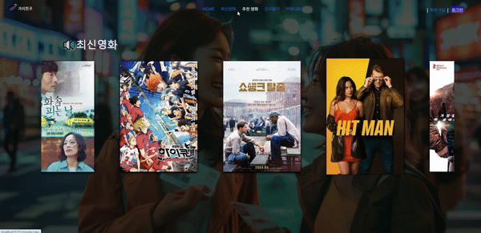
</p>
<h2> Let's make movie mate - 새로운 영화와 새로운 친구를 만나보세요!</h2>
<p>내가 본 영화를 누가 봤는지 궁금하지 않나요?<br>
        또 내가 좋아하는 영화를 좋아하는 사람은요?<br>
        그리고 그 사람이 당신 근처에 있다는 게 설레지 않나요?<br>
        마치 마니또를 만난 기분이예요!<br>
        당신의 취향이 새로운 인연을 만들어 줍니다!</p>
        

<h2 id="credits"> 📜사용한 기술 :</h2>
<!-- CREDITS -->
Kang hyeonseong & Park subin


<h2> 🙍‍♀️&🙍‍♂️ 1. 팀원 정보 및 업무 분담 </h2>

<p>백&프론트 기능 구현과 프론트&CSS 디자인으로 나누어 작업했습니다</p>
<h4>강현성(백&프론트&CSS | 기능 구현&DB 작업&CSS 디자인) :</h4>
<ul>
  <li><b>회원가입/유저 프로필 커스텀 마이징</b> - 선호장르, 성별, 지역, 프로필 사진 등 다양한 정보를 입력 가능하도록 회원가입 기능과 프로필 기능을 추가했습니다. </li>
  <li><b>영화 추천 알고리즘</b> - 유저가 선호하는 장르와 가장 인기있는 영화, 2가지를 추천하도록 알고리즘을 구현했습니다.</li>
  <li><b>친구 추천 기능</b> - 현재 사용자의 정보를 바탕으로 적절한 다른 이용자들을 추천하는 기능을 구현했습니다.</li>
  <li><b>이용자들간 소통 기능 - 이용자들이 게시판과 댓글을 통해 소통이 가능한 기능을 구현했습니다.
  <li><b>근처 영화관 지도 기능 - 이용자의 선택 위치를 바탕으로 영화관 검색이 가능한 지도 기능을 구현했습니다.</li>
</ul>

<h4>박수빈(프론트&CSS | 프론트 레이아웃&CSS 디자인):</h4>
<ul>
  <li><b>페이지 레이아웃 디자인</b> - Figma를 이용하여 전체적인 레이아웃 디자인을 담당하였습니다.</li>
  <li><b>랜딩페이지 & 네비바 디자인 - 전체적인 페이지 틀 및 네비바 기능 구현 및 디자인을 담당했습니다.</li>
  <li><b>영화 정보 모달 디자인</b> - 동적으로 반응하는 영화 상세정보 모달을 디자인 했습니다.</li>
  <li><b>프로필 & 친구추천 & 게시판 CSS 디자인</b> - 유저의 프로필과 추천 친구 및 친구 목록, 글 게시판과 상세 게시글의 디자인을 담당하였습니다.</li>
</ul>

<h4>공동작업:</h4>
<ul>
  <li><b>영화 추천 페이지 디자인</b> - 페이지를 넘기는 유저와의 반응을 통하여 영화 데이터를 보여줄 수 있게 했습니다.</li>
  <li><b>친구 추천 페이지 디자인</b> - 유저에게 가장 적절한 친구를 보여주는 페이지 CSS 작업을 했습니다.</li>
</ul>


<h2> 🛠 2. 목표 서비스 구현 및 실제 구현 정도</h2>

<h3>1. 영화 추천
<p>회원가입시 이용자가 선택한 장르와 API 사이트 유저들의 전체 평점을 기준으로 영화를 추천했습니다.
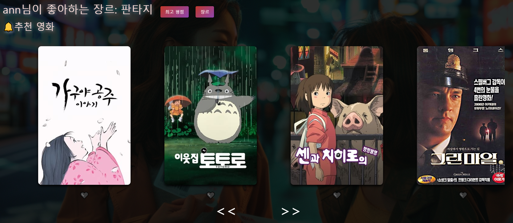</p>

<h3>2. 친구 추천
<p>현재 이용자와 선호하는 장르가 같거나 현재 지역 데이터가 가까운 이용자들을 추천하여 친구추가를 통해 이용자들의 정보를 볼 수 있게 하였습니다. 
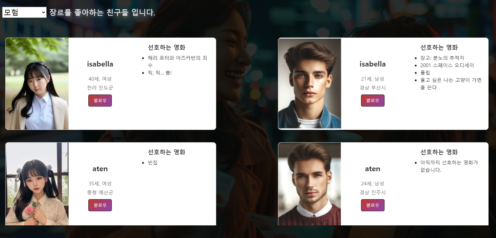
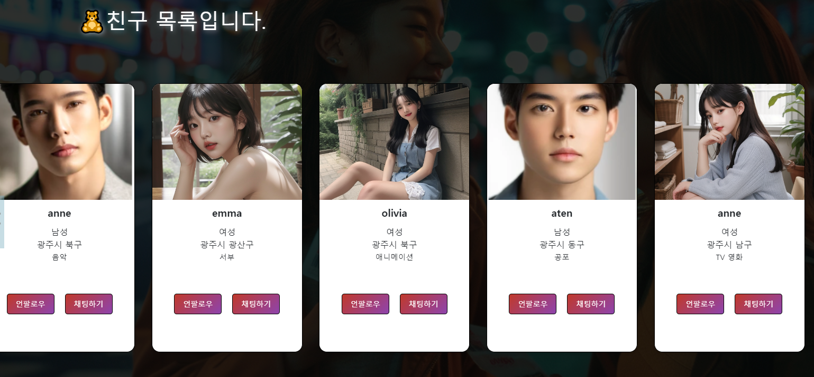</p>


<h3>3. 이용자들 간 소통</h3>
이용자들 간 소통할 수 있도록, 게시판을 만들었습니다. 게시판에서 자유롭게 글을 작성할 수 있으며, 누가 작성했는지 알 수 있도록 했습니다. 또한, 댓글 기능을 구현하여 게시글에 추가적으로 소통을 할 수 있게 했습니다.
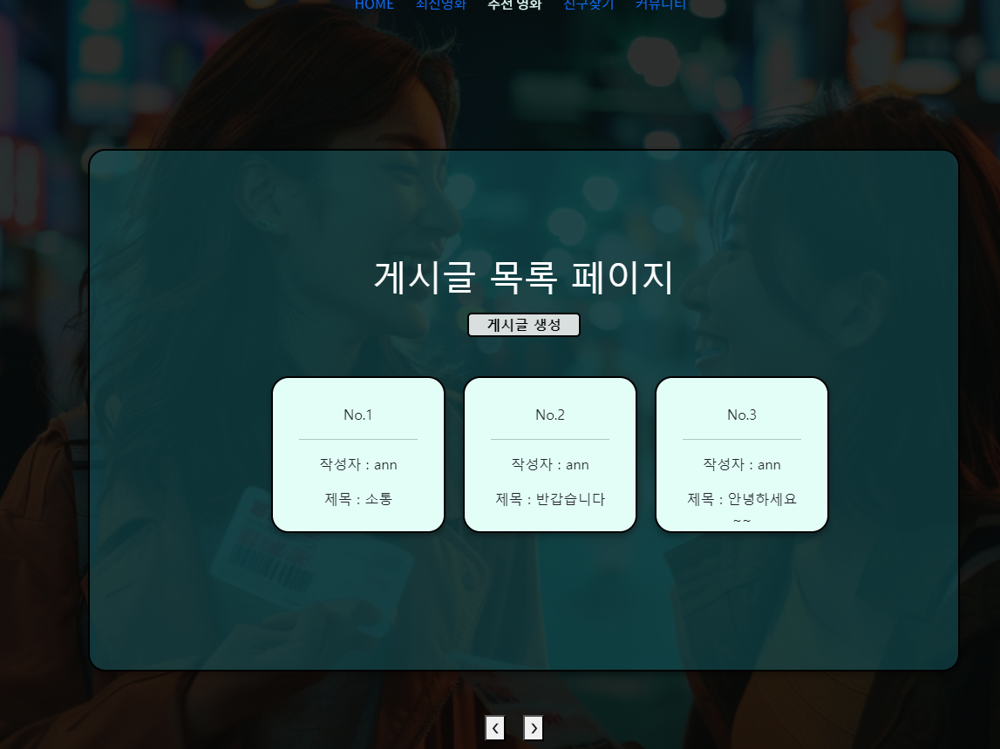
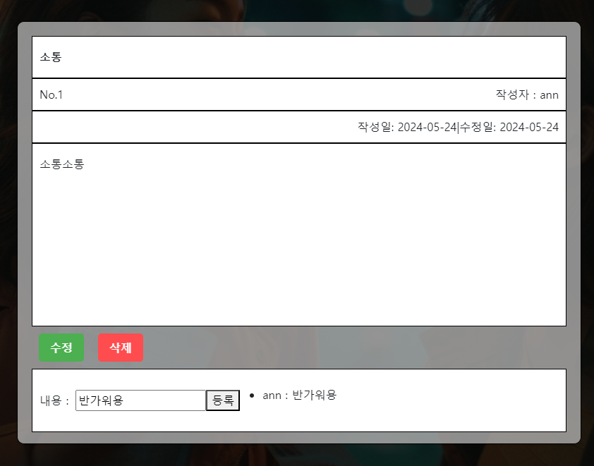
</p>


<h2>🧮 3. DB Base Modeling and Vue Components</h2>
<p>ERD와 컴포넌트 별 기능도는 다음과 같습니다.:</p>
<p><b>1) DB 데이터 ERD</b></p>
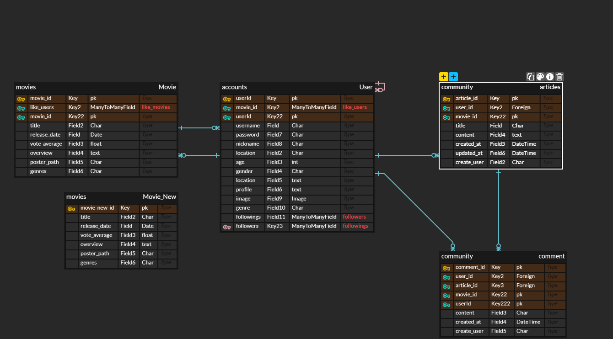
<p>첫번째로, User의 경우 articles, comment 와 1:N 관계를 가지고 있습니다.
이를 통해 어떤 이용자가 글을 작성했는지, 댓글을 달았는지 알 수 있습니다.

두번째로는 Movie와 User간의 ManyToMany 관계입니다. 이를 통해 이용자는 영화들에게 좋아요을 할 수 있게 되며, 영화들은 현재 좋아요 수를 알 수 있습니다.

세번째로는 User들 간의 ManyToMany 관계입니다. 이를 통해서 이용자들은 서로 팔로우를 할 수 있습니다.
</p>
<p><b>2) Vue Components</b></p>
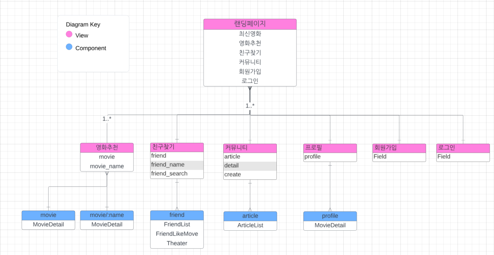
<p>각 기능별로 View.vue를 나누었습니다. 그리고 추가적으로 필요한 Component들을 추가하여 부모-자식 관계를 정의했습니다. 영화추천과 프로필 처럼 이용자 개인의 페이지인 경우 parms 를 통하여 경로 이동이 가능하게 했습니다.</p>


<h2> 🎬4. 영화 추천 알고리즘</h2>

<h3>1. 이용자 평점 추천</h3>
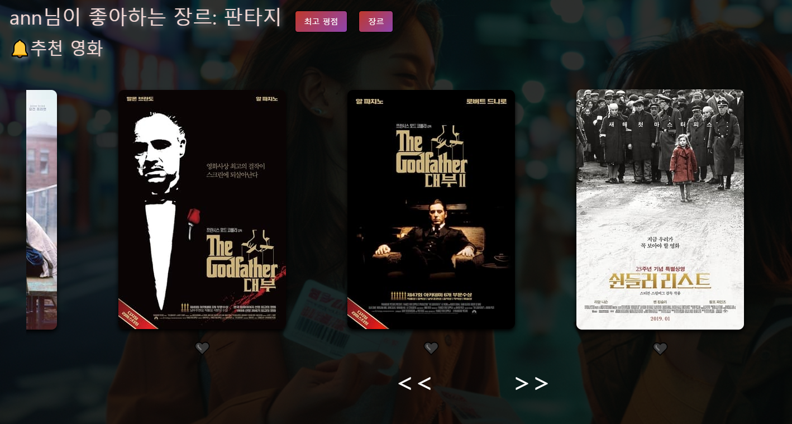
<p>1. 최고 평점 : TMDB API를 통하여 전 세계의 사람들에게 높은 평점을 받은 영화 리스트를 가져왔습니다. 그 후, 일정수 이상의 투표수를 가진 영화들 중 평점순으로 내림차순 정렬하여 영화들을 추천하는 알고리즘을 구현했습니다. </p>


</P>

<h3>2. 이용자가 선호하는 장르 기반 영화 추천 </h3>
<p>User model에 있는 genre 데이터 정보를 기반으로 해당 장르 태그를 가진 영화들만 필터하여 추천하는 알고리즘을 구현했습니다.</p>


```JavaScript
const filteredMoviesTop = computed(() => {
  return movieList.value
    .slice() // 원본 배열의 복사본을 생성
    .sort((a, b) => b.vote_average - a.vote_average) // vote_average를 기준으로 내림차순 정렬
    .slice(0, 30); // 상위 30개의 영화만 반환
});

const filteredMoviesGenre = computed(() => {
  return movieList.value.filter((movie) =>
    movie.genres.includes(userInfo.value.genre) // 이용자가 선택한 장르가 영화의 장르에 들어가 있는지 판단
  );
});

```


<h1> 📰 5. 핵심 기능에 대한 설명 - 친구 추천</h1>
<h2>1. 추천 친구 목록 & 현재 친구 목록</h2>
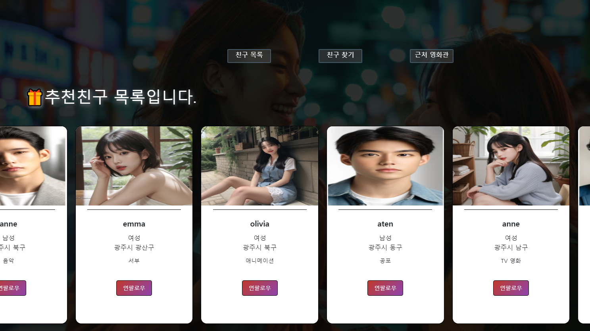
<P>DB에 저장된 현재 로그인한 이용자의 정보를 기반으로 추천 친구를 보여줍니다.

```JavaScript
const filteredUsers = computed(() => {
  // userInfo에 현재 로그인한 사용자의 정보가 저장되어 있고,
  // userslist에는 로그인하지 않은 사용자 목록이 있어야 합니다.
  return userslist.value.filter(
    (user) =>
      // 로그인한 유저와 다른 유저를 비교
      user.pk !== userInfo.pk &&
      // // 같은 장르를 선호하는지 확인
      user.genre === userInfo.genre ||
      // 근처 지역인지 확인
      user.pk !== userInfo.pk &&
      user.location.split(" ")[0] === userInfo.location.split(" ")[0]
  );
});
```
같은 장르이거나 근처 지역인 친구를 전체 이용자 데이터에서 필터를 통하여 보여줍니다.
그후, 팔로우 버튼을 통하여 친구 목록에 추가할 수 있습니다.

```JavaScript
// 각 사용자의 팔로우 상태를 저장하는 객체
const followStatus = ref({});

// 사용자의 초기 팔로우 상태를 설정하는 함수
const setInitialFollowStatus = () => {
  filteredUsers.value.forEach((user) => {
    followStatus.value[user.pk] = userInfo.followings.includes(user.pk); // userInfo.followings에 포함되어 있는지 확인
  });
};

watch(filteredUsers, setInitialFollowStatus, { immediate: true });

const toggleFollow = async (userId) => {
  try {
    const response = await axios({
      method: "post",
      url: `${API_URL}/api/v1/user/follow/${userId}/`,
      headers: {
        Authorization: `Token ${token.value}`,
      },
    });

    if (response.data.status === "success") {
      console.log("팔로우 상태가 변경되었습니다.");
      followStatus.value[userId] = !followStatus.value[userId];

      if (followStatus.value[userId]) {
        userInfo.followings.push(userId); // 팔로우 추가
      } else {
        userInfo.followings = userInfo.followings.filter((id) => id !== userId); // 팔로우 제거
      }
    }
  } catch (error) {
    console.error("팔로우 처리 중 오류가 발생했습니다.", error);
  }
};

const followButtonText = (userId) => {
  return followStatus.value[userId] ? "언팔로우" : "팔로우";
};
```

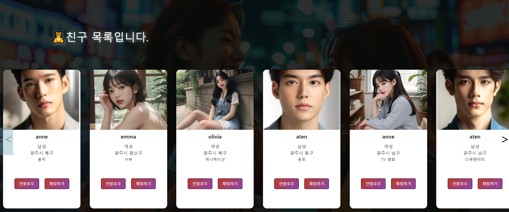

</p>


<h2>2. 장르별 친구 목록 </h2>
<p>각 이용자가 선택한 장르를 기반으로 친구 추천을 보여줍니다. 이때, 다른 장르의 추천 친구도 나올 수 있게 했습니다.</p>

```JavaScript
// 선택된 장르에 맞는 친구 목록을 업데이트하는 함수
const updateFriendList = () => {
  friendList.value = userList.value.filter(user => user.genre === selectedGenre.value);
};
```
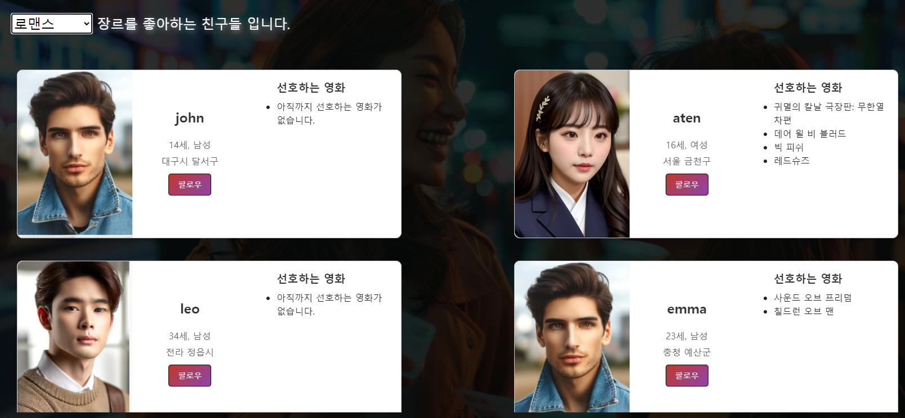

<h2>3. 근처 영화관 목록 </h2>
<p>카카오의 MAP API를 이용하여 이용자 지역 근처의 영화관이 나오도록 했습니다.
회원 가입시, 이용자의 지역에 맞는 좌표 값이 자동으로 들어가게 설정하여 현재 위치를 알 수 있는 기능도 추가했습니다.</p>
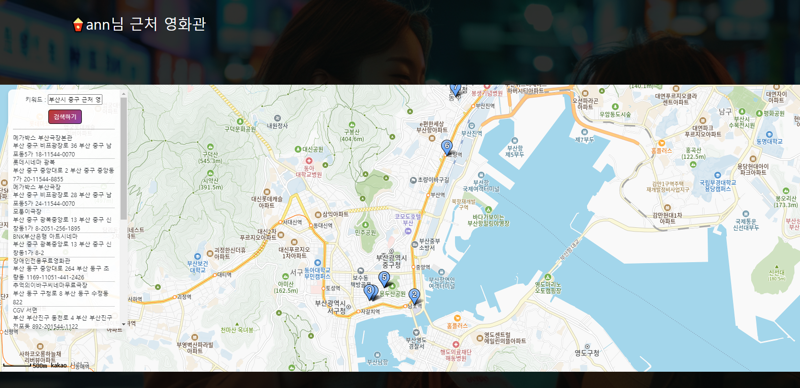


<h1>💡 6. 느낀점과 후기</h1>

<h2>💂강현성</h2>
<p>처음 주도적으로 이끌어 갔던 프로젝트라 그런지 기획부터 빌드업까지 많은 혼란이 생겼습니다.
기획의 중요성을 다시 한번 깨달았으며, 팀원과의 소통이 프로젝트 결과에 많은 영향을 주는 것을 배운 계기가 되었습니다.

기능을 하나씩 구현해 나갈때마다 성장하는 느낌이 들어 시간이 가는줄 모르면서 재밌게 작업했습니다. 만약 다시 하게 된다면, 생각만 하고 넣지 못한 다양한 기능들을 만들어 보고 싶습니다.</p>

<h2>🙍‍♀️박수빈</h2>
<p>처음으로 페어를 짜 파트너와 함께 프로젝트를 하는 경험을 했다. 깃으로 결과물을 공유하는 과정에서 우여곡절이 많았는데 merge와 branch의 이용 방법을 잘 알고 꼼꼼하고 주의 깊게 사용해야한다고 느꼈다. 프로젝트 초기에 프론트엔드/백엔드로 역할을 나누어 프론트엔드를 맡았는데 기능 구현에 어려움을 느껴 파트너가 기능 구현 대부분을 담당하고 디자인에 집중했다. 많은 일을 하게 된 파트너에게 미안했고 프론트 엔드 = 디자인이라고 생각했던 과거를 반성했다. 프론트 엔드의 기능을 더 공부해야 할 계기가 됐고 2학기 프로젝트에서는 더 큰 역할을 하고 싶다고 생각했다. 백지 상태에서 점점 완성되어가는 웹페이지를 보니 뿌듯했고 팔로우/언팔로우 표시, 버튼 색깔 변경, 게시판 글쓰기 등 각각의 요소가 정상적으로 작동하는 게 신기했고 웹페이지가 동작함에 있어 커다란 흐름을 알 수 있었다. </P>


<h2> 작업 순서 </h2>
# 24.05.14.
## 프론트엔드
- 최신영화 데이터 출력 중
## 백엔드

# 24.05.14.
## 프론트엔드
- 최신영화 데이터 출력 중
## 백엔드


# 24.05.15.
## 프론트엔드
## 백엔드
- 전체 영화 리스트 데이터 불러오기
- 영화 데이터에 장르 추가


# 24.05.16.
## 프론트엔드
## 백엔드
- 로그인, 회원가입 기능 추가
- 게시판 글 작성기능 , 게시글 상세보기 기능 추가
- 로그아웃 기능 추가
- 비 로그인시 커뮤니티 기능 제한

# 24.05.17.
## 프론트엔드
## 백엔드
- 회원가입 추가 정보 추가(성별, 지역, 선호장르, 나이, 닉네임)
- 영화 데이터 로컬로 전환

# 24.05.18
## 백엔드
- 영화 추천 알고리즘 구현
- 마이페이지 구현

# 24.05.19
## 백엔드
- 유저 마이페이지 추가
- 영화 추천 페이지 추가(유저가 선호하는 장르를 기반)
- 게시판 글 작성, 상세보기 수정 -> 글 작성자 추가
- 게시글 댓글 기능 추가


# 24.05.19
## 백엔드
- 유저 팔로우 기능 추가
- 친구 추천 기능 구현
- 근처 영화관 구현

# 24.05.20
## 프론트엔드
- 최신영화, 추천영화 화면 구현
- 네비바, 메인페이지 css 수정
## 백엔드
- 지역별 친구 추천 기능 추가
- 장르별 친구 추천 페이지 추가
- 친구 목록 페이지 추가

# 24.05.21
## 백엔드
- 추천 영화 CSS 디자인 추가 -> 슬라이드로 넘기기
- 주변 근처 영화관 지도 수정
- 유저 더미 데이터 추가
- 영화 데이터 추가

# 24.05.21
## 백엔드
- 메인 페이지 CSS 디자인 추가
- 영화 상세 설명 CSS디자인
- 추천 영화 알고리즘 추가
- 페이지 로고 추가

# 24.05.22
## 프론트
- 최신 영화 디자인 수정
- 추천 영화 배경화면 추가 
- 친구 추천, 친구 목록 디자인, 버튼 수정
- 마이페이지 디자인 수정


# 24.05.23
## 백엔드
- 게시글 U,D 기능 구현
- 영화추천페이지 유튜브 API 모달 구현

